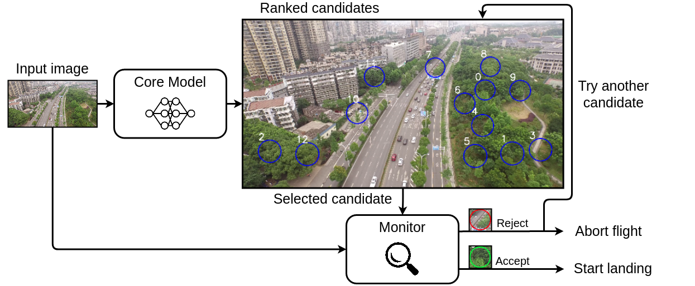

### Supplementary material
* Details about **computing an estimate of the ground size** for a given pixel can be found [here](Supplementary/ICRA2022_supplementary_pixelSize.pdf).
* A notebook to compute the $\beta$ safety coefficient for the 
* **Full results** can be found [here](https://github.com/jorisguerin/ANITI_UavEmergencyLanding/blob/gh-pages/Supplementary/full_results.csv).

### Code
The code for our approach can be found [here](https://github.com/jorisguerin/ANITI_UavEmergencyLanding/tree/main)

### Contact
[Joris GUERIN](https://jorisguerin.github.io/)  
Laboratoire d'Analyse et d'Architecture des Systèmes (LAAS-CNRS)  
7 avenue du Colonel Roche, 31031 TOULOUSE, FRANCE  
**email**: jorisguerin.research@gmail.com
